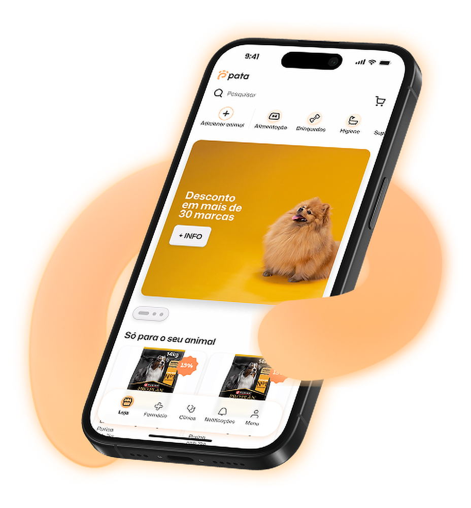
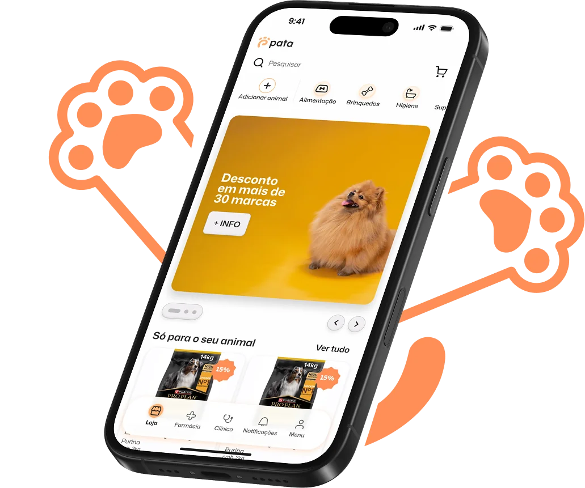

# 🚀 PATA Website Optimization — Especificação para Claude Code

## 📋 Contexto do Projeto

**Site:** https://pata.care  
**Stack:** HTML/CSS/JS vanilla, hospedado no GitHub Pages  
**Ficheiros principais:**
- `index.html` (~119K)
- `src/css/dist/styles.min.css` (~143K)
- `src/js/dist/scripts-critical.min.js` (~13K)
- `src/js/dist/scripts-lazy.min.js` (~8K)
- `src/js/dist/scripts-deferred.min.js` (~17K)

**Scores atuais PageSpeed Insights (Mobile — 9 Fev 2026):**
- Performance: **87**
- FCP: 1.1s ✅
- LCP: **3.4s** ⚠️ (objetivo: <2.5s)
- TBT: 60ms ✅
- CLS: 0.018 ✅
- Speed Index: 5.3s ⚠️

**Objetivo:** Atingir **90+ Performance mobile**, corrigir LCP e melhorar acessibilidade.

---

## 🎯 PRIORIDADE 1: Corrigir LCP (Largest Contentful Paint) — 3.4s → <2.5s

### Problema Identificado
A imagem LCP é o mockup do hero (`mockup_no_bg.webp`). Apesar de ter `fetchpriority="high"` e `loading="eager"`, o LCP está a 3.4s no mobile porque:

1. A imagem está dentro de um `<picture>` com `<source>` WebP + fallback PNG
2. O CSS da stylesheet (carregada async) define `.mockup-center { opacity: 0; transition: opacity .6s ease .4s }` — mesmo com o fix inline `opacity: 1 !important`, há conflito de timing
3. O preload aponta para `./src/img/new_images/mockup_no_bg.webp` com caminho relativo
4. A imagem original tem dimensões 476×952 — demasiado grande para mobile

### Diagnósticos PageSpeed Insights (9 Fev 2026)

#### ⚠️ LCP Request Discovery
O PageSpeed reporta para a imagem LCP:
- ✅ Lazy load not applied (correto — `loading="eager"`)
- ❌ **`fetchpriority=high` should be applied** — apesar de estar no HTML, o browser não está a reconhecer corretamente
- ✅ Request is discoverable in initial document

Elemento LCP identificado:
```html

```

#### 🟡 Improve Image Delivery — Est. savings: 151 KiB

| Imagem | Resource Size | Est Savings | Problema |
|--------|--------------|-------------|----------|
| `mockup_no_bg.webp` (hero LCP) | 97.8 KiB | 79.6 KiB | Imagem 928×1000 exibida a 400×431 — **2.3× maior que necessário** |
| `PATA_APP.webp` (segunda referência) | 68.5 KiB | 60.6 KiB | Imagem 1031×861 exibida a 350×292 — **~3× maior que necessário** (usa `loading="lazy"`, `width="613"`, `height="511"`) |
| `problem1_video2_poster.webp` (video poster) | 20.6 KiB | 10.6 KiB | Imagem 720×863 exibida a 412×732 — poster do vídeo background oversized |

**Total 1st Party savings:** 186.9 KiB → **150.8 KiB possíveis de poupar**

**Nota sobre `PATA_APP.webp`:** Este elemento usa `srcset` com `sizes="(max-width: 768px) 100vw, 613px"` mas a imagem source (1031w) continua demasiado grande para o tamanho de exibição real.

### Correções a Implementar

#### 1.0 — Gerar imagens responsivas (reduzir 151 KiB)

As imagens servidas são significativamente maiores que o tamanho de exibição. Criar versões otimizadas:

```bash
# mockup_no_bg.webp: servida a 928×1000, exibida a 400×431 (mobile)
# Criar versão mobile @1x (400×431) e @2x (800×862)
cwebp -q 80 -resize 400 0 mockup_no_bg.webp -o mockup_no_bg_mobile.webp
cwebp -q 80 -resize 800 0 mockup_no_bg.webp -o mockup_no_bg_mobile_2x.webp

# PATA_APP.webp: servida a 1031×861, exibida a 350×292 (mobile)
# Criar versão mobile adequada
cwebp -q 80 -resize 613 0 PATA_APP.webp -o PATA_APP_613w.webp
cwebp -q 80 -resize 350 0 PATA_APP.webp -o PATA_APP_350w.webp

# problem1_video2_poster.webp: 720×863, exibida a 412×732
# Criar versão adequada ao display size
cwebp -q 75 -resize 412 0 problem1_video2_poster.webp -o problem1_video2_poster_mobile.webp
```

> **NOTA:** Se usar `imagemagick` em vez de `cwebp`, usar `convert input.webp -resize WIDTHx output.webp`.

#### 1.1 — Otimizar imagem LCP para mobile
```bash
# Criar versão mobile da imagem (metade da resolução)
# Se ffmpeg/imagemagick disponível:
# convert mockup_no_bg.webp -resize 238x476 mockup_no_bg_mobile.webp
```

No `index.html`, alterar o `<picture>` do mockup (linha ~654-665):

**DE:**
```html
<picture>
    <source srcset="./src/img/new_images/mockup_no_bg.webp" type="image/webp">
    
</picture>
```

**PARA:**
```html
<picture>
    <source srcset="./src/img/new_images/mockup_no_bg_mobile.webp" type="image/webp" media="(max-width: 768px)">
    <source srcset="./src/img/new_images/mockup_no_bg.webp" type="image/webp">
    
</picture>
```

> **NOTA:** Se não for possível criar a imagem mobile, manter apenas o `<source>` original. A otimização de tamanho pode ser feita depois manualmente.

#### 1.2 — Corrigir preload para suportar mobile
No `<head>` do `index.html` (linha ~18), alterar:

**DE:**
```html
<link rel="preload" href="./src/img/new_images/mockup_no_bg.webp" as="image" type="image/webp">
```

**PARA:**
```html
<link rel="preload" href="./src/img/new_images/mockup_no_bg.webp" as="image" type="image/webp" media="(min-width: 769px)">
<link rel="preload" href="./src/img/new_images/mockup_no_bg_mobile.webp" as="image" type="image/webp" media="(max-width: 768px)">
```

> **NOTA:** Se não existir versão mobile, manter o preload original sem `media` attribute.

#### 1.2b — Otimizar srcset da segunda imagem PATA_APP.webp

A segunda imagem `PATA_APP.webp` (68.5 KiB) está a ser servida a 1031w mas exibida a 350×292 em mobile. Adicionar srcset com versões responsivas:

**DE:**
```html

```

**PARA:**
```html

```

> **NOTA:** Se não forem geradas as versões menores, manter o srcset original. A poupança estimada é ~60.6 KiB.

#### 1.3 — Eliminar conflito de opacity no CSS crítico inline
Na seção `<style>` inline do `<head>` (por volta da linha 479), o fix atual é:

```css
.mockup-center {
    opacity: 1 !important;
}
```

**Adicionar também:**
```css
.mockup-center {
    opacity: 1 !important;
    transition: none !important;
}
.mockup-image {
    content-visibility: auto;
}
```

Isto garante que a imagem LCP aparece instantaneamente sem esperar por transição CSS.

#### 1.4 — Mover CSS crítico do mockup para inline
Garantir que no `<style>` crítico inline existe:

```css
.mockup-image {
    width: 476px;
    height: auto;
    object-fit: contain;
    position: relative;
    z-index: 5;
    aspect-ratio: 476/952;
}

@media (max-width: 768px) {
    .mockup-image {
        width: auto;
        height: 100%;
        max-width: 400px;
        max-height: 100%;
    }
}
```

---

## 🎯 PRIORIDADE 2: Otimização de Performance JavaScript

### 2.1 — Shader WebGL: Pausar quando fora do viewport

No ficheiro `scripts-critical.min.js`, a classe `LiquidShader` tem um método `animate()` que corre em loop infinito via `requestAnimationFrame`. Existem **3 canvas shaders** no site:
- `liquid-shader-canvas` (hero)
- `liquid-shader-canvas-joinus2`
- `liquid-shader-canvas-joinus3`

**Problema:** Os 3 shaders correm sempre, mesmo quando fora do viewport. Em mobile, isto consome GPU desnecessariamente.

**Solução:** Adicionar `IntersectionObserver` ao `LiquidShader` para pausar/retomar:

No ficheiro **fonte** de `scripts-critical.js` (antes de minificar), modificar a classe `LiquidShader`:

```javascript
// Dentro do constructor ou init, APÓS criar o canvas:
this.isVisible = true;
this.visibilityObserver = new IntersectionObserver((entries) => {
    entries.forEach(entry => {
        this.isVisible = entry.isIntersecting;
        if (this.isVisible && !this.animating) {
            this.animating = true;
            this.animate();
        }
    });
}, { threshold: 0.01 });
this.visibilityObserver.observe(this.canvas);
```

```javascript
// No método animate(), adicionar no início:
animate() {
    if (!this.isVisible) {
        this.animating = false;
        return;
    }
    // ... resto do código existente
}
```

**Em mobile (< 768px), desativar shaders completamente:**

```javascript
// No constructor do LiquidShader, logo no início:
if (window.innerWidth < 768 && !window.matchMedia('(hover: hover)').matches) {
    // Mobile: não inicializar shader, usar CSS fallback
    return;
}
```

O CSS fallback já existe no `styles.min.css` dentro de `@media (prefers-reduced-motion: reduce)` — o mesmo gradiente CSS pode ser ativado como fallback.

### 2.2 — Consolidar IntersectionObservers

No ficheiro `scripts-deferred.min.js`, existem **15+ classes** separadas (Problem1, Problem2, Solution1, etc.), cada uma criando o seu próprio `IntersectionObserver`.

**Solução:** Criar um observer centralizado:

```javascript
// AnimationManager - substitui os 15+ observers individuais
class AnimationManager {
    constructor() {
        this.observer = new IntersectionObserver((entries) => {
            entries.forEach(entry => {
                if (entry.isIntersecting) {
                    const targets = entry.target.querySelectorAll('[data-animate]');
                    targets.forEach(el => el.classList.add('visible'));
                    // Opcional: unobserve após animação (one-shot)
                    this.observer.unobserve(entry.target);
                }
            });
        }, {
            threshold: 0.15,
            rootMargin: '0px 0px -50px 0px'
        });
    }

    observe(selector) {
        document.querySelectorAll(selector).forEach(el => {
            this.observer.observe(el);
        });
    }
}
```

> **NOTA:** Esta refatoração é complexa. Se preferires uma abordagem incremental, basta garantir que cada observer chama `unobserve()` após a animação disparar, evitando monitorização contínua.

### 2.3 — Otimizar Scroll Handler (ScrollToTopButton)

O `ScrollToTopButton` no `scripts-deferred.min.js` tem um método `updateArrowColor()` que chama `document.elementFromPoint()` **em cada frame de scroll**. Isto força reflow.

**Solução:** Substituir por cálculo baseado em offsets pré-computados:

```javascript
// Em vez de document.elementFromPoint() no scroll:
// Pré-calcular secções escuras no init
this.darkSections = [];
document.querySelectorAll('#hero, #problem1, #problem3, #problem4, #solution1, #solution3, #joinus2, #joinus3').forEach(el => {
    this.darkSections.push({
        top: el.offsetTop,
        bottom: el.offsetTop + el.offsetHeight
    });
});

// No scroll handler, usar os offsets:
updateArrowColor() {
    const scrollY = window.scrollY + window.innerHeight - 60;
    const isDark = this.darkSections.some(s => scrollY >= s.top && scrollY <= s.bottom);
    this.btn.classList.toggle('white-arrow', isDark);
}
```

E usar throttle no scroll:
```javascript
// Throttle a 100ms em vez de cada frame
let scrollTimeout;
window.addEventListener('scroll', () => {
    if (!scrollTimeout) {
        scrollTimeout = setTimeout(() => {
            this.updateArrowColor();
            scrollTimeout = null;
        }, 100);
    }
}, { passive: true });
```

### 2.4 — Respeitar `prefers-reduced-motion` no JavaScript

Adicionar no início de `scripts-critical.js`:

```javascript
const prefersReducedMotion = window.matchMedia('(prefers-reduced-motion: reduce)').matches;
```

E usar esta flag para:
- **Não inicializar** `LiquidShader` se `prefersReducedMotion === true`
- **Não inicializar** `HeaderParallax`
- **Não inicializar** `MouseHighlight`
- **Simplificar** ou desativar animações de entrada

### 2.5 — Parar loops rAF do header quando fora de vista

`HeaderParallax` e `MouseHighlight` usam `requestAnimationFrame` em loop contínuo. Adicionar o mesmo padrão de visibility observer:

```javascript
// No HeaderParallax e MouseHighlight:
const heroSection = document.querySelector('#hero, .header-section');
const heroObserver = new IntersectionObserver(([entry]) => {
    if (entry.isIntersecting) {
        this.resume();
    } else {
        this.pause();
    }
}, { threshold: 0.01 });
heroObserver.observe(heroSection);
```

---

## 🎯 PRIORIDADE 3: Acessibilidade (A11y)

### 3.1 — Corrigir Hierarquia de Headings

**Problema:** Os headings saltam níveis (h1 → h3, h2 → h4 → h2, etc.), violando WCAG 2.1 Success Criterion 1.3.1.

A regra é: **não usar headings para styling, usar para estrutura semântica.** Os estilos visuais devem ser controlados pelas classes CSS, não pela tag HTML.

**Estrutura correta por secção:**

| Secção | Tag Atual | Tag Correta | Classe CSS (manter) |
|--------|-----------|-------------|---------------------|
| **Hero** | `<h1>` | `<h1>` ✅ | `.header-title` |
| **Problem1** left panel h3 | `<h3>` | `<h2>` | manter estilo via classe |
| **Problem1** right panel h3 | `<h3>` | `<h2>` | manter estilo via classe |
| **Problem1** info box h4 | `<h4>` | `<h3>` | manter estilo via classe |
| **Problem2** `.problem2-title` | `<h4>` | `<h2>` | `.problem2-title` |
| **Problem2** `.problem2-conclusion` | `<h3>` | `<p>` | `.problem2-conclusion` (é texto visual, não heading) |
| **Problem2** `.problem2-cost-label` | `<h4>` | `<p>` | `.problem2-cost-label` |
| **Problem2** `.problem2-cost-value` | `<h2>` | `<p>` | `.problem2-cost-value` (é dado visual) |
| **Problem3** `.problem3-title-main` | `<h2>` | `<h2>` ✅ | manter |
| **Problem3** `.problem3-subtitle` | `<h4>` | `<p>` | `.problem3-subtitle` |
| **Problem3** `.problem3-description` | `<h4>` | `<p>` | `.problem3-description` |
| **Problem3** `.problem3-stat-value` (×3) | `<h2>` | `<p>` | `.problem3-stat-value` (dados visuais) |
| **Problem3** `.problem3-stats-footer` | `<h4>` | `<p>` | `.problem3-stats-footer` |
| **Problem4** `.problem4-title` | `<h2>` | `<h2>` ✅ | manter |
| **Problem4** `.problem4-subtitle` | `<h3>` | `<p>` | `.problem4-subtitle` |
| **Problem4** `.validation-number` (×3) | `<h2>` | `<p>` | `.validation-number` (dados visuais) |
| **Problem4** `.validation-label` (×3) | `<h4>` | `<p>` | `.validation-label` |
| **Problem4** `.survey-info` | `<h4>` | `<p>` | `.survey-info` |
| **Problem4** `.survey-disclaimer` | `<h5>` | `<p>` | `.survey-disclaimer` |
| **Problem5** `.problem5-title` | `<h2>` | `<h2>` ✅ | manter |
| **Problem5** `.testimonial-author-name` (×3) | `<h5>` | `<p>` | `.testimonial-author-name` |
| **Problem5** `.problem5-footer-main` | `<h2>` | `<p>` | `.problem5-footer-main` |
| **Problem5** `.problem5-footer-subtext` | `<h2>` | `<p>` | `.problem5-footer-subtext` |
| **Problem5** `.problem5-footer-question` | `<h2>` | `<p>` | `.problem5-footer-question` |
| **Solution1** `.solution1-title` | `<h2>` | `<h2>` ✅ | manter |
| **Solution1** `.solution1-card-label` | `<h4>` | `<p>` | `.solution1-card-label` |
| **Solution1** `.solution1-card-price` | `<h2>` | `<p>` | `.solution1-card-price` |
| **Solution1** card column h4s | `<h4>` | `<p>` | manter classe |
| **Solution1** card column h2s | `<h2>` | `<p>` | manter classe |
| **Solution2** `.solution2-title` | `<h2>` | `<h2>` ✅ | manter |
| **Solution2** `.solution2-subtitle` | `<h4>` | `<p>` | `.solution2-subtitle` |
| **Solution3** `.solution3-title` | `<h2>` | `<h2>` ✅ | manter |
| **Solution3** `.solution3-card-title` | `<h4>` | `<h3>` | manter estilo |
| **Solution3** subtexts (h5s) | `<h5>` | `<p>` | manter classes |
| **Solution3** `.solution3-credit-value` | `<h2>` | `<p>` | `.solution3-credit-value` |
| **Solution3** `.solution3-credit-outro` | `<h4>` | `<p>` | `.solution3-credit-outro` |
| **Solution4** `.solution4-title` | `<h2>` | `<h2>` ✅ | manter |
| **Solution4** `.clinica-title` | `<h4>` | `<h3>` | `.clinica-title` |
| **Solution4** `.clinica-urgencias/consultas` | `<h5>` | `<p>` | manter classes |
| **Solution4** `.clinica-plus` | `<h4>` | `<span>` | `.clinica-plus` |
| **Solution4** `.bottom-card-title` (×2) | `<h4>` | `<h3>` | `.bottom-card-title` |
| **JoinUs1** `.joinus1-title` | `<h2>` | `<h2>` ✅ | manter |
| **JoinUs1** `.joinus1-subtitle` | `<h4>` | `<p>` | `.joinus1-subtitle` |
| **JoinUs1** `.card-label` | `<h2>` (price-value) | `<p>` | `.price-value` |
| **JoinUs1** `.card-section-title` | `<h3>` | `<h3>` ✅ | manter |
| **JoinUs1** `.joinus1-middle-title` | `<h3>` | `<h3>` ✅ | manter |
| **JoinUs1** `.plan-title` (×vários) | `<h5>` | `<p>` | `.plan-title` |
| **JoinUs1** `.plan-highlight` | `<h3>` | `<p>` | `.plan-highlight` |
| **JoinUs1** `.plan-number` | `<h2>` | `<p>` | `.plan-number` |
| **JoinUs1** `.best-value-text` | `<h3>` | `<p>` | `.best-value-text` |
| **JoinUs2** benefit card titles (×4) | `<h5>` | `<p>` | `.benefit-card-title` |
| **JoinUs2** `.joinus2-bottom-statement` | `<h3>` | `<p>` | `.joinus2-bottom-statement` |
| **JoinUs2** `.warning-card-title` | `<h4>` | `<p>` | `.warning-card-title` |
| **JoinUs3** `.joinus3-title` | `<h2>` | `<h2>` ✅ | manter |
| **FAQ** `.faq-title` | `<h2>` | `<h2>` ✅ | manter |
| **Reservar** `.reservar-form-title` | `<h2>` | `<h2>` ✅ | manter |
| **Reservar** `.reservar-card-title` (×2) | `<h4>` | `<h3>` | `.reservar-card-title` |

**Resumo da hierarquia correta:**
```
h1 — Hero (único h1 na página)
  h2 — Problem1 (left/right panel titles)
    h3 — Problem1 info box
  h2 — Problem2 title
  h2 — Problem3 title
  h2 — Problem4 title
  h2 — Problem5 title
  h2 — Solution1 title
  h2 — Solution2 title
  h2 — Solution3 title
    h3 — Solution3 card titles
  h2 — Solution4 title
    h3 — Clinica, bottom cards
  h2 — JoinUs1 title
    h3 — Card section titles, middle title
  h2 — JoinUs3 title
  h2 — FAQ title
  h2 — Reservar form title
    h3 — Reservar card titles
```

**Tudo o resto** que é visualmente grande mas não é heading semântico → usar `<p>` ou `<span>` com as mesmas classes CSS.

### 3.2 — Corrigir Contraste de Cores

**Elementos com contraste insuficiente identificados pelo Lighthouse:**

| Elemento | Cor atual texto | Cor fundo | Ratio atual | Fix |
|----------|----------------|-----------|-------------|-----|
| `.problem2-title` (h4→h2) | `#525252` | `#FFF8F2` | ~5.3:1 | OK — mas verificar se é o parent background |
| `.problem2-story` (p) | `#525252` | `#FFF8F2` | ~5.3:1 | OK |
| `.problem2-conclusion` | `#525252` | `#FFF8F2` | ~5.3:1 | OK |
| `.problem2-cost-label` | `#3D3D3D` | `#FFF8F2` | OK |
| `.problem2-cost-value` | `#525252` | `#FFF4E6` | ~4.9:1 | **Mudar para `#4A4A4A`** (ratio 5.2:1) |
| `.footer-link` | `#FEFEFF` | `#272727` | OK |
| `.footer-copyright` | `#FEFEFF` | `#272727` | OK |
| `.footer-legal` | `#FEFEFF` | `#272727` | OK |
| `.footer-disclaimer` | `#FEFEFF` | `#272727` | OK |

**Secções Problem2 — o fundo real pode ser outro:** Se o `#problem2` tem `background-color: #FFF8F2` mas há elementos sobre gradientes, o contraste pode falhar. Verificar se texto `#525252` sobre `#FFF8F2` está realmente abaixo de 4.5:1.

**Fix para os elementos do footer que falham (se aplicável):**
O footer tem `background: #272727` e texto `#FEFEFF` — isto tem ratio **16.4:1**, que é excelente. Se o Lighthouse reporta falha, pode ser por outro fundo calculado. Verificar especificamente os `<a class="footer-link">` que podem herdar cor diferente.

**Correções no CSS:**

```css
/* No styles.css (antes de minificar), adicionar/alterar: */

/* Problem2 - garantir contraste suficiente */
.problem2-cost-value {
    color: #3D3D3D; /* era #525252, aumentar contraste sobre #FFF4E6 */
}

/* Footer links - garantir contraste */
.footer-link {
    color: #FEFEFF; /* garantir que não herda outra cor */
}
```

### 3.3 — Adicionar ARIA labels e roles em falta

```html
<!-- No carousel de imagens do Reservar, adicionar: -->
<div class="reservar-image-carousel" role="region" aria-label="Galeria de imagens PATA" aria-roledescription="carousel">

<!-- Nos cards que são interativos mas não são links/buttons: -->
<div class="price-card-grey" role="article" tabindex="0" aria-label="Preço urgência veterinária tradicional">
<div class="price-card-orange" role="article" tabindex="0" aria-label="Preço urgência com PATA">

<!-- No FAQ, garantir que cada item tem: -->
<button class="faq-question-button" aria-expanded="false" aria-controls="faq-answer-N">
<div class="faq-answer" id="faq-answer-N" role="region" aria-labelledby="faq-question-N">
```

### 3.4 — Adicionar `lang` attributes para conteúdo misto

Se houver textos em inglês (ex: "Founder Member", "MELHOR VALOR"):

```html
<h5 class="benefit-card-title"><span lang="en">Badge "Founder Member"</span></h5>
```

---

## 🎯 PRIORIDADE 4: Otimizações CSS

### 4.1 — Adicionar `content-visibility` a secções abaixo do fold

Já existe no CSS mas confirmar que cobre todas as secções:

```css
#problem1, #problem2, #problem3, #problem4, #problem5,
#solution1, #solution2, #solution3, #solution4,
#joinus1, #joinus2, #joinus3,
#reservar, #faq, footer {
    content-visibility: auto;
    contain-intrinsic-size: auto 800px;
}
```

> ✅ Isto JÁ EXISTE no CSS. Verificar que está a ser aplicado corretamente.

### 4.2 — Limpar `will-change` desnecessários

No CSS atual, muitos elementos têm `will-change: transform, opacity` permanentemente. Isto consome memória GPU.

**Regra:** Apenas aplicar `will-change` durante animação, remover depois.

O CSS já tem:
```css
.header-content.visible,
.pill-left-top.visible,
/* etc. */
.mockup-center.visible {
    will-change: auto;
}
```

> ✅ Isto JÁ EXISTE. Verificar que funciona para todos os elementos.

### 4.3 — Reduzir box-shadows em mobile

```css
@media (max-width: 768px) {
    .price-card-grey,
    .price-card-orange,
    .problem3-stat-card,
    .testimonial-card,
    .solution3-card,
    .joinus1-card,
    .bottom-plan-card,
    .benefit-card {
        box-shadow: 0 2px 8px rgba(0,0,0,0.1);
    }
    
    /* Desativar animações de hover complexas em touch */
    .price-card-grey.visible:hover,
    .price-card-orange.visible:hover,
    .testimonial-item.visible .testimonial-card:hover,
    .solution3-card.visible:hover,
    .joinus1-card.visible:hover,
    .bottom-plan-card.visible:hover,
    .benefit-card.visible:hover {
        animation: none !important;
        transform: none !important;
    }
}
```

---

## 🎯 PRIORIDADE 5: Otimizações HTML adicionais

### 5.1 — Adicionar `decoding="async"` a imagens não-LCP

Todas as imagens com `loading="lazy"` devem ter também `decoding="async"`:

```bash
# Regex para encontrar: loading="lazy" sem decoding="async"
# Em todas as  com loading="lazy", adicionar decoding="async"
```

### 5.2 — Converter pills do hero para `loading="lazy"` mais agressivo

As 4 pill images no hero (vet, cat, dog, gato_persa) já têm `loading="lazy"`. ✅

### 5.3 — Adicionar `<meta name="theme-color">`

```html
<meta name="theme-color" content="#000000" media="(prefers-color-scheme: dark)">
<meta name="theme-color" content="#FFF8F2" media="(prefers-color-scheme: light)">
```

---

## 📝 CHECKLIST DE VERIFICAÇÃO

Após implementar as alterações, validar:

- [ ] LCP < 2.5s no PageSpeed mobile
- [ ] Performance ≥ 90 no mobile
- [ ] Accessibility ≥ 95
- [ ] Sem heading skips (h1→h2→h3 sequencial)
- [ ] Contraste ≥ 4.5:1 em todo o texto normal
- [ ] Contraste ≥ 3:1 em texto grande (≥18pt ou ≥14pt bold)
- [ ] Shaders pausam quando fora do viewport
- [ ] `prefers-reduced-motion` respeitado no JS
- [ ] Scroll handler não usa `elementFromPoint()`
- [ ] `will-change` removido após animação completar
- [ ] Sem erros na consola do browser
- [ ] Layout visual idêntico ao original (sem regressões visuais)

---

## ⚠️ NOTAS IMPORTANTES

1. **Não alterar o visual** — todas as mudanças são internas (performance + semântica). O aspeto visual deve permanecer idêntico.
2. **CSS classes mantidas** — ao mudar `<h4>` para `<p>`, a classe CSS mantém-se. Os estilos no CSS já estão aplicados via classe (ex: `.problem2-title`), por isso a mudança de tag não afeta o visual.
3. **Testar em mobile real** — o PageSpeed emula Moto G Power com Slow 4G. Testar também num dispositivo real.
4. **Minificação** — após alterar os ficheiros fonte JS, re-minificar para `scripts-critical.min.js`, `scripts-deferred.min.js`, etc.
5. **Git commit** — fazer commit atómico por tipo de alteração (LCP fix, heading hierarchy, contrast fixes, JS performance).

---

## 🔧 ORDEM DE IMPLEMENTAÇÃO RECOMENDADA

1. **Heading hierarchy** (HTML only, zero risk) → commit
2. **Contrast fixes** (CSS only, minimal risk) → commit
3. **LCP optimizations** (HTML + inline CSS) → commit + test PageSpeed
4. **JS shader pausing** (JS changes) → commit + test scroll performance
5. **JS observer consolidation** (JS refactor) → commit + full regression test
6. **CSS mobile optimizations** (CSS tweaks) → commit + final PageSpeed test
